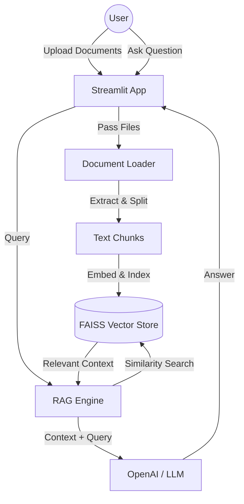

# 📚 RAG Document Q&A System


An enterprise-grade Retrieval-Augmented Generation (RAG) system built with LangChain, FAISS, and Streamlit. This application allows users to seamlessly upload multiple document types (PDF, TXT, DOCX) and interactively query them using Large Language Models (LLMs).

## ✨ Features

- **Multi-Document Support**: Process PDF, TXT, and DOCX files.
- **Smart Chunking**: Configurable recursive character splitting for optimal context retrieval.
- **Vector Storage**: Persistent local vector search using FAISS and HuggingFace/OpenAI embeddings.
- **Conversational Memory**: Maintains chat history for contextual follow-up questions.
- **Clean UI**: Built with Streamlit for a responsive and intuitive user experience.

## 🏗️ Architecture



## 🚀 Installation

1. **Clone the repository:**
   ```bash
   git clone https://github.com/yourusername/rag-document-qa.git
   cd rag-document-qa
   ```

2. **Create a virtual environment:**
   ```bash
   python -m venv venv
   source venv/bin/activate  # On Windows use `venv\Scripts\activate`
   ```

3. **Install dependencies:**
   ```bash
   pip install -r requirements.txt
   ```

4. **Configure environment variables:**
   Copy the example file and add your OpenAI API key.
   ```bash
   cp .env.example .env
   ```

## 💻 Usage

Run the Streamlit application:
```bash
streamlit run app.py
```
Open your browser and navigate to `http://localhost:8501`. Upload some documents and start asking questions!

## 📊 Results & Screenshots
*The application successfully answers detailed queries based on uploaded document contexts without hallucinating.*
